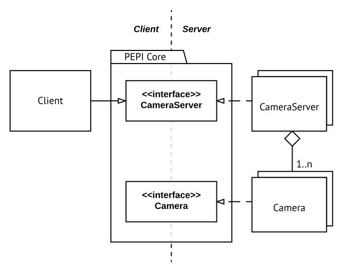

.. _about:

===========
About PEPI
===========

What is PEPI?
=============
PEPI's is intended to be used as a method to acquire stereo-photogrammetry imagery. It should be noted that PEPI does not yet perform any of the photogrammetric analysis - that is reserved for existing software.

The implementation and design of PEPI was completed in a 12 week project as part of an undergraduate capstone project with Griffith University. The development of PEPI is detailed in the thesis, "A Low-cost Distributed Camera System for Stereo-photogrammetry", which provides more in-depth justifications than could reasonably fit here.

Terminology
===========
In this documentation, we use the following terms:

.. glossary::

   Client
      the computer running the PEPI client/control software, which manages all connected servers

   Server
      A camera-equipped computer running the PEPI server software

   Raspberry Pi
   RPi
   Pi
      The `Raspberry Pi`_ is a low-cost, single-board computer produced by the Raspberry Pi foundation.

   Camera Module
   PiCamera
      The small camera accessory sold for the Raspberry Pi, or the Python library that interfaces with it.

   Distro
      A distribution of an operating system eg. Ubuntu, Raspbian, etc.

.. _Raspberry Pi: https://www.raspberrypi.org/
.. _hardware:

PEPI's Structure
================

PEPI's structure is best described using the class diagram below:

PEPI is really just the PEPI core, which is two language-neutral interface definition files. This file defines the whole PEPI system and how all other components should be implemented. Of course, having this definition doesn't help when you need to `use` the system, because it doesn't actually do anything. To use the system, you'll need implementations of these interfaces on your servers so that a client may control the server.

We expect that there will--for the most part--only ever need to be one `base` server-side implementation of this interface `per language`. The base implementation for a language may be subclassed and modified to suit specific needs, because most functionality is shared between servers of a single language. In this repo, we provide  a minimal implementation of a Python server (:py:class:`~server.base_camera_server.BaseCameraServer`), as well as an example of extending that server for use on a Raspberry Pi (:py:class:`~raspi_server.raspi_server.RaspPiCameraServer`).

We provide a Python client with a user interface that can control `any` server on the network that implements the interface, no matter the language. While it would be valid to do so, we don't expect that there would be a need to write a new client--just use the provided one.

So to recap, PEPI is:

* The PEPI core, i.e. an interface definition file. The other components are merely implementations of this interface.
* A collection of server implementations in different languages, each addressing a different use case.
* A Python client, which should be applicable to all use cases (i.e. just use the provided client rather than writing your own).

Hardware
========
At present, the only concrete server implementation in the GitHub repo is for the Raspberry Pi's. To run the provided implementation, you will need:

* Raspberry Pi (any model) and Raspberry Pi Camera Module (any version) with matching cable
* 8GB or larger microSD card, preferably Class 10 for speed
* Quality power supply
* Router or switch -- wireless if you wish to connect the RPi's over Wi-Fi
* A Unix-based computer to run the client software (may work on others - untested)

PEPI versions lower than v2.0 were intended for use solely with RPi's with the RPi camera only. V2.0 introduced a redesigned architecture that supports new server implementations and new cameras. This means that any server implementation should be able to use any camera, as long as that camera has an adapter written for it that conforms to the PEPI spec. Any server can be controlled by the provided Python client implementation.

New implementations do not need to be in Python but abstract base classes and contract tests are provided to simplify Python development. As communication between server and client occurs over `Apache Thrift`_, support for cross-language, cross-platform implementations is built-in.

If you're looking to write a new implementation, refer to the :ref:`Extending Pepi <extending-pepi>` section.

.. _Apache Thrift: https://thrift.apache.org/

Motivations
===========

The design choices behind PEPI are motivated by several constraints and requirements. These have affected how PEPI has been designed and implemented.

Some of these motivations:

#. Indifferent to number of servers, so new servers can be brought online at any time without any manual setup (i.e., dynamic server discovery).
#. Rapidly deployable and easy to use
#. Extensible, well-documented and able to support future needs
#. Rapidly and reliably capture images across all cameras
#. Cross-platform, cross-language, so servers running new hardware (e.g. new computer, new cameras) can be implemented in the future without changes to the overall architecture.
#. Ultimately, produce a low-cost system that can scale.
