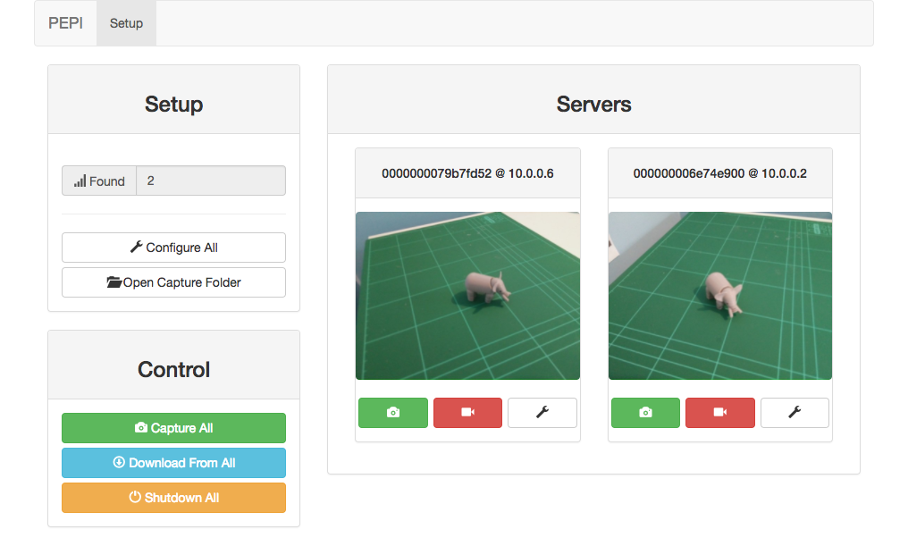
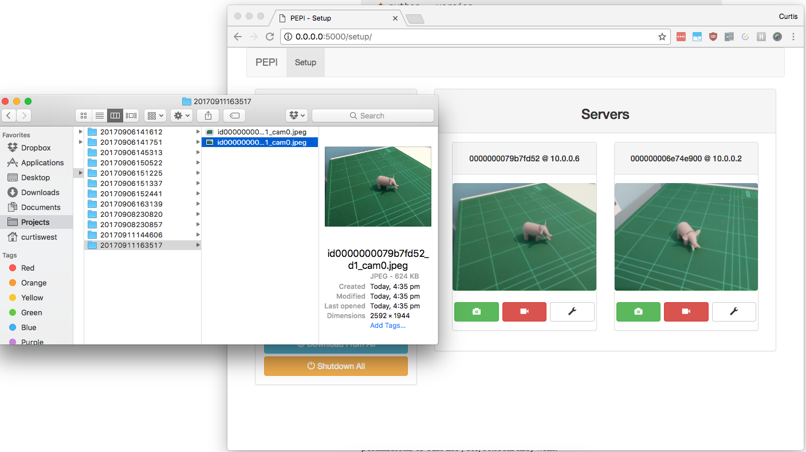
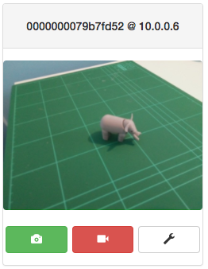
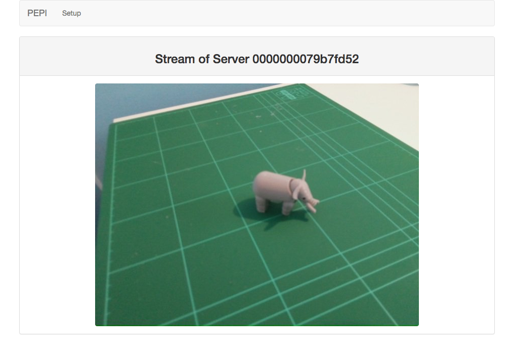

.. _using-pepi:

==========
Using PEPI
==========

Once you've got your servers installed and running, and your client launches correctly (see :ref:`Installation` for more details), you're ready to use PEPI.

Open your browser and browse to `<http://0.0.0.0:5000/>`_. You'll see the PEPI interface:

Hopefully you'll find that the buttons are relatively self-explanatory for the most part.

The user interface is responsive -- if you scale the window, the user interface will resize appropriately.

You can access the user interface presented by the client from any device that is on the same network. Therefore, you can control PEPI from a smartphone or tablet by browsing to ``http://<ip-of-your-PC>:5000/``. Images will still be downloaded to the `client PC` regardless of what device you use to access the user interface.

Setup Panel
===========

The `Setup` panel holds information and controls for all the operations necessary before you start using the tool.

The `Found` box shows how many PEPI servers were found on the network. Note that some servers may have more than one camera attached to them, but this is not reflected in the count. This number should match the physical number of servers on your network -- if the number is lower than expected, your server may not be properly configured or running. PEPI will automatically discover servers on the network every 5 seconds, but the count won't update until you refresh the page.

The `Configure All` button is not presently implemented (indeed, no configuration is implemented yet).

The `Open Capture Folder` button opens the folder on the computer running the client that contains images captured from the servers.

Control Panel
=============

The `Control` panel holds the control for actually using the tool (i.e. capturing images) once the system is set up.

.. note::
   The number of servers in the `Found` box may not be up-to-date as you must refresh the page to see the updated count.

   However, all the controls here will still command `all` detected servers, as detecting servers is independent of the user interface's display.

The `Capture All` button sends a "take photo" command to all detected servers. The servers will capture an image and store in their local memory indefinitely. This allows for bulk captures without being delayed by waiting for downloads to occur image-by-image.

.. warning::
   There are no lockouts on the `Capture All` button. Pressing the button too frequently may cause server instability depending on the server's implementation. At the very least, you are likely to lose synchronisation between captured images.

   It is not possible to implement a timed lockout, as PEPI only understands "servers", not "cameras" and so it cannot understand how long each camera takes to capture an image.

   Therefore, we recommend that you understand how long it takes for your servers' to capture one image, and only press the `Capture All` button as quickly as the server can support.

The `Download All` button requests all captured images from the server as JPEGs. It is safe to press this even when new servers have come online, as the client remembers which server "owes" us images. Once the download is complete, your file explorer will open to the image's locations, as shown:

The images are saved with the following naming notation:

.. code-block:: text

   id{server_id}_d{unique capture #}_cam{server camera #}.jpeg

   For example:
   id000000006e74e900_d70_cam0.jpeg
   id000000006e74e900_d70_cam1.jpeg
   id000000006e74e900_d70_cam2.jpeg
   id000000006e74e900_d71_cam0.jpeg
   id000000006e74e900_d71_cam1.jpeg
   id000000006e74e900_d71_cam2.jpeg

The `Shutdown All` button requests all detected servers to shutdown. Note that a server implementation may choose not to implement this functionality, but they will still accept the backing function call nonetheless.

Servers Panel
=============

The `Servers` panel shows you all the detected servers and allows for individual control.

Each card in the panel represents one server. If the server supports a livestream from the camera, you'll see shown in the centre of the card.

The header of each card contains it's server ID and it's network IP:

.. code-block:: text

   0000000079b7fd52 @ 10.0.0.6
   {server id}      @ {server ip}

The green camera button captures an image from `only` this server.

The red camera button starts a full-screen stream from the servers camera, if supported:

The grey wrench button will be used for configuring an individual server in the future, but is currently not supported.
